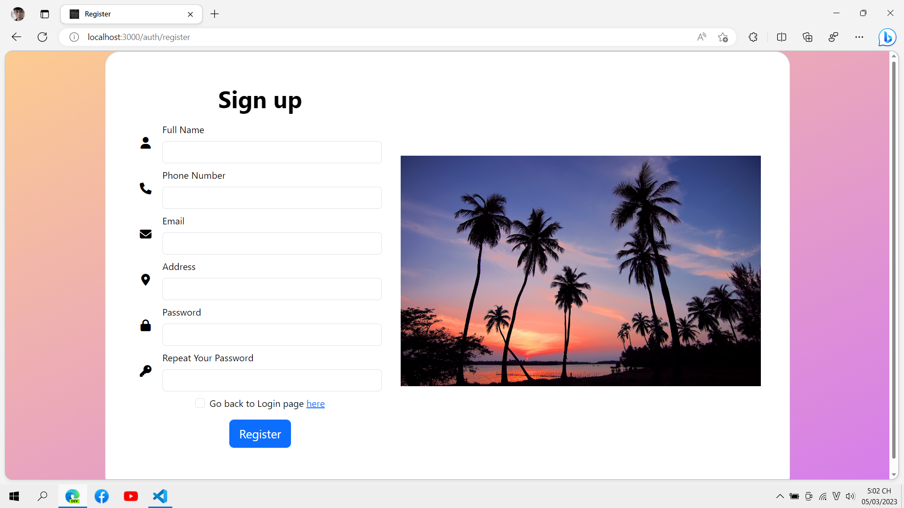
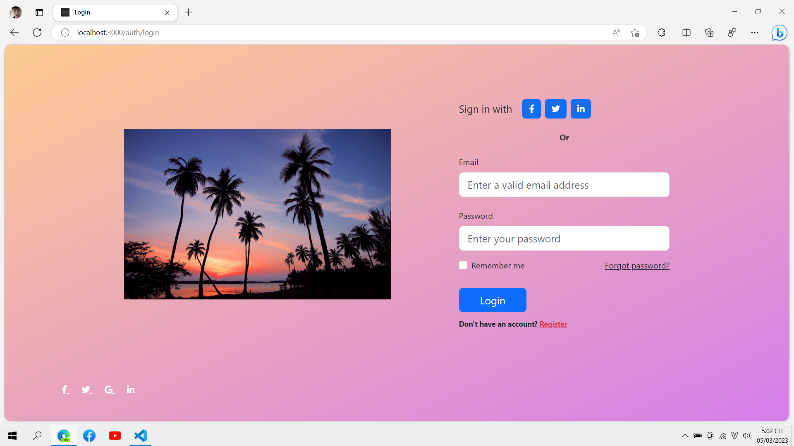
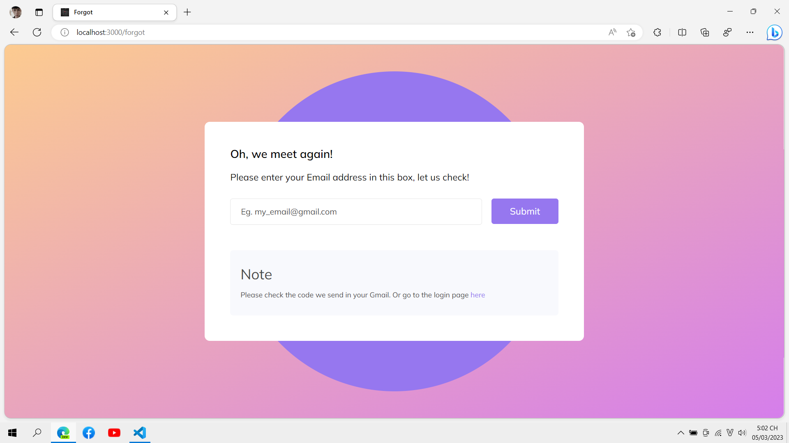
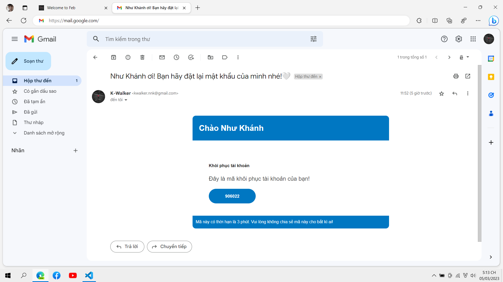
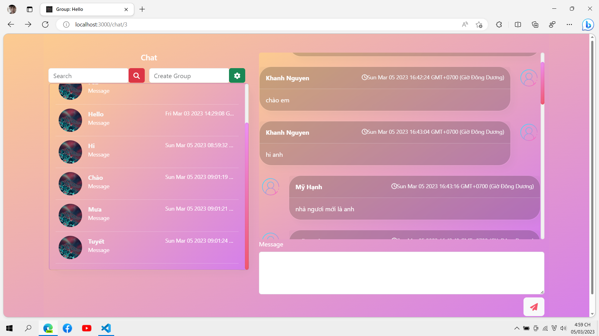
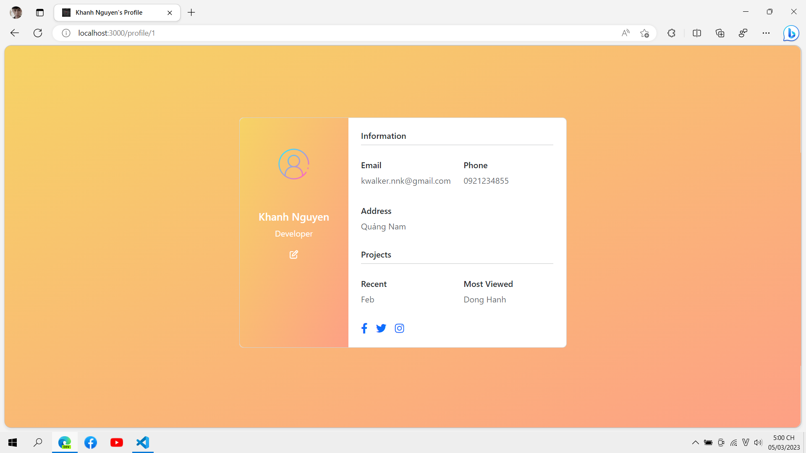
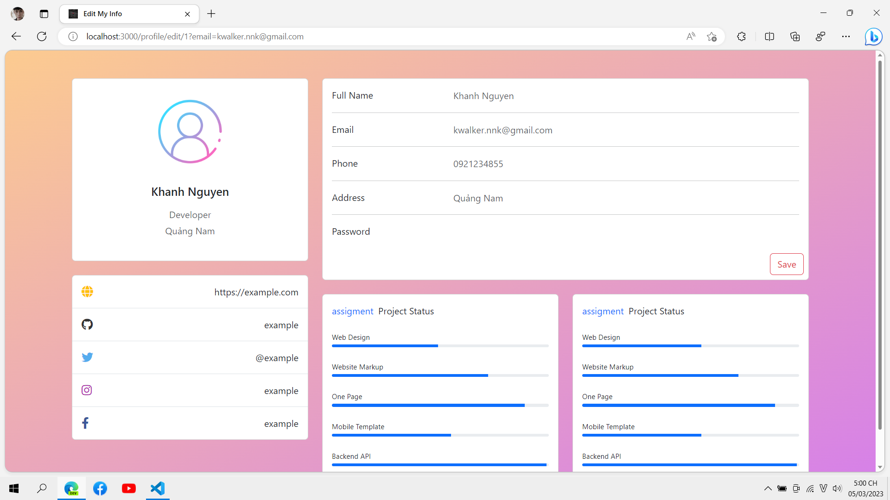

<p align="center">
  <a href="http://nestjs.com/" target="blank"></a>
</p>

  <p align="center">A progressive <a href="http://nodejs.org" target="_blank">Node.js</a> framework for building efficient and scalable server-side applications.</p>


## ROUTES

Describe some routes that have not been used but have already been created

| METHOD | LINK | DETAILED DESCRIPTION |
| ------ | ------ | ------ |
| GET | http://localhost:3000/chat/messages?conversation-id=1 | Show all messages by conversation |
| GET | http://localhost:3000/chat/messages/find?conversation-id=1&limit=5 | Get messages by conversation but limit message display. For example limit = 5, get the last 5 messages |


## IMAGES
Register




Login




Recovery




Mailer




Chat




Profile




Edit My Info




## Description

[Nest](https://github.com/nestjs/nest) framework TypeScript starter repository.

## Information

[K-Walker](https://www.facebook.com/KWalkerNNK) Please message me if you have any questions.

## Installation

```bash
$ npm install
```

## Running the app

```bash
# development
$ npm run start

# watch mode
$ npm run start:dev

# production mode
$ npm run start:prod
```

## Test

```bash
# unit tests
$ npm run test

# e2e tests
$ npm run test:e2e

# test coverage
$ npm run test:cov
```

## Support

Nest is an MIT-licensed open source project. It can grow thanks to the sponsors and support by the amazing backers. If you'd like to join them, please [read more here](https://docs.nestjs.com/support).

## License

Nest is [MIT licensed](LICENSE).
